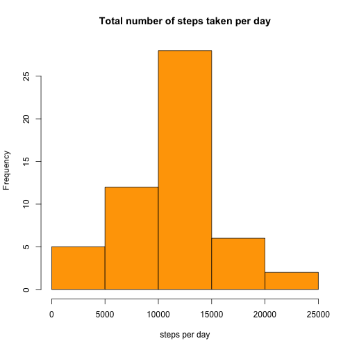
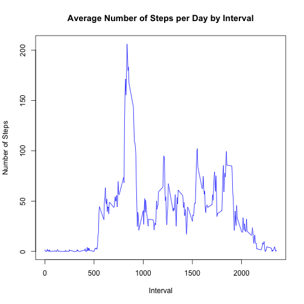
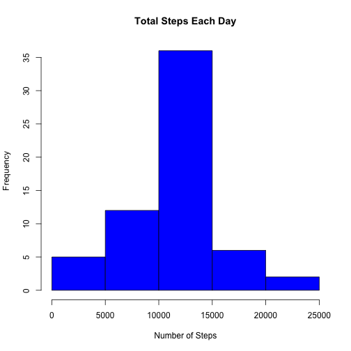
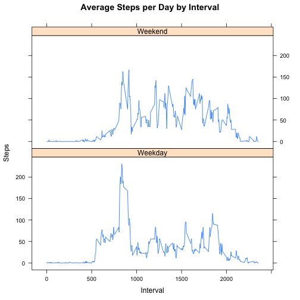

# Question #1

```r
data <- read.csv("activity.csv", header = TRUE, sep = ",", 
                 na.strings = "NA")

data$date <- as.Date(data$date, format = "%Y-%m-%d")
data_no_NA <- data[!is.na(as.character(data$steps)),]

steps_per_day <- aggregate(steps ~ date, 
                           data = data_no_NA, sum)
                           
hist(steps_per_day$steps,col = "orange", 
     main = "Total number of steps taken per day",
     xlab = "steps per day")
```



```r
mean(steps_per_day$steps)
```

```
## [1] 10766.19
```

```r
median(steps_per_day$steps)
```

```
## [1] 10765
```

#Question #2

```r
steps_by_interval <- aggregate(steps ~ interval, 
                               data = data_no_NA, mean)
plot(steps_by_interval$interval,steps_by_interval$steps, 
     type="l", col = "blue", xlab="Interval", 
     ylab="Number of Steps",
     main="Average Number of Steps per Day by Interval")
```



```r
max(steps_by_interval$steps)
```

```
## [1] 206.1698
```

#Question #3

```r
sum(is.na(data))
```

```
## [1] 2304
```

```r
NA_rows <- which(is.na(data$steps))

StepsAverage <- aggregate(steps ~ interval, data = data, FUN = mean)
fillNA <- numeric()
for (i in 1:nrow(data)) {
        obs <- data[i, ]
        if (is.na(obs$steps)) {
                steps <- subset(StepsAverage, interval == obs$interval)$steps
        } else {

                steps <- obs$steps
        }
        fillNA <- c(fillNA, steps)
}
new_activity <- data
new_activity$steps <- fillNA
sum(is.na(new_activity))
```

```
## [1] 0
```

```r
StepsTotalUnion <- aggregate(steps ~ date, data = new_activity, sum, na.rm = TRUE)
hist(StepsTotalUnion$steps, main = paste("Total Steps Each Day"), col="blue", xlab="Number of Steps")
```



#Question #4

```r
weekdays <- c("Monday", "Tuesday", "Wednesday", "Thursday", 
              "Friday")
new_activity$dow = as.factor(ifelse(is.element
                                    (weekdays(as.Date(new_activity$date)),
                                            weekdays), "Weekday", "Weekend"))
StepsTotalUnion <- aggregate(steps ~ interval + dow, new_activity, mean)
library(lattice)
xyplot(StepsTotalUnion$steps ~ StepsTotalUnion$interval|StepsTotalUnion$dow, 
       main="Average Steps per Day by Interval",xlab="Interval", ylab="Steps",
       layout=c(1,2), type="l")
```


